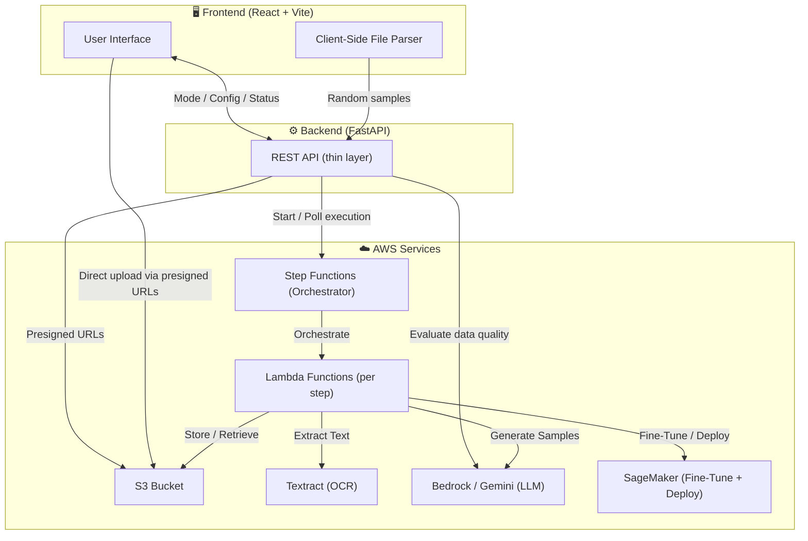
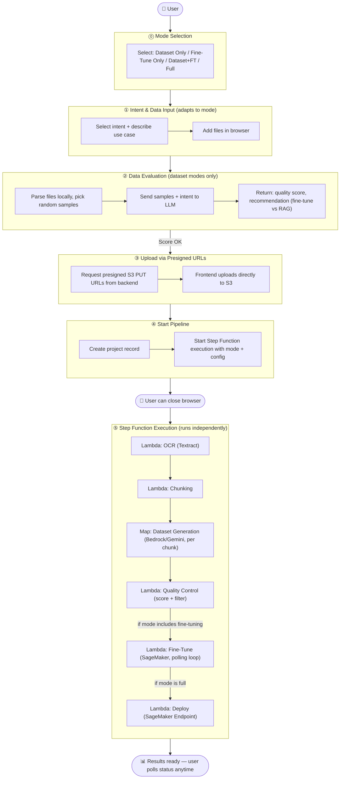
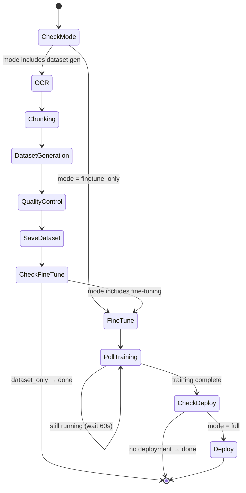

# Modifai — Architecture Workflow

> **Mode Selection → Data Input → Evaluation → Upload → Step Functions Pipeline → Results**

## Execution Modes

The user selects an execution mode **first**, which determines the required inputs:

| Mode | Pipeline Steps | User Provides |
|------|---------------|---------------|
| **Dataset Only** | OCR → Chunk → Generate → QC → Export JSONL | Intent, description, document files |
| **Fine-Tune Only** | Fine-tune on SageMaker | JSONL dataset file, base model |
| **Dataset + Fine-Tune** | OCR → Chunk → Generate → QC → Fine-tune | Intent, description, document files, base model |
| **Full Pipeline** | OCR → Chunk → Generate → QC → Fine-tune → Deploy | Intent, description, document files, base model, deployment config |

## High-Level Architecture



---

## User Flow



---

## Step Functions State Machine (Choice Branching)



---

## Backend API (FastAPI — thin layer)

| Endpoint | Method | Purpose |
|----------|--------|---------|
| `/api/evaluate-data` | POST | Send random samples + intent to LLM; return quality score + recommendation |
| `/api/upload/presign` | POST | Generate presigned S3 PUT URLs for client-side upload |
| `/api/projects` | POST | Create project record in DB |
| `/api/projects` | GET | List user's projects |
| `/api/projects/{id}/start` | POST | Start Step Function execution with mode + config |
| `/api/projects/{id}/status` | GET | Poll Step Function execution status + step-level progress |
| `/api/projects/{id}/results` | GET | Fetch final outputs (dataset S3 URL, model endpoint, download link) |
| `/api/projects/{id}` | DELETE | Delete project and associated S3 data |

Additional endpoints for dataset review/editing (when user wants to inspect generated data before fine-tuning):

| Endpoint | Method | Purpose |
|----------|--------|---------|
| `/api/projects/{id}/dataset` | GET | List generated training examples (paginated) |
| `/api/projects/{id}/dataset/{example_id}` | PUT | Edit a training example |
| `/api/projects/{id}/dataset/{example_id}` | DELETE | Remove a training example |
| `/api/projects/{id}/dataset/export` | GET | Download dataset as JSONL |

---

## S3 Bucket Structure

```
s3://modifai-bucket/
└── {user_uuid}/
    └── {project_uuid}/
        ├── data/              # Uploaded raw files (via presigned URLs)
        ├── models/            # Fine-tuned model artifacts (SageMaker output)
        └── temp_processing/   # Intermediate OCR text, chunks, examples
            ├── raw_text.json
            ├── chunks.json
            ├── examples.json
            └── clean_dataset.jsonl
```

---

## Step Details

| Step | What | How | AWS Service |
|------|------|-----|-------------|
| **⓪** | Mode Selection | User picks execution mode; UI adapts inputs | Frontend |
| **①** | Intent + Data Input | User selects intent, describes use case, adds files | Frontend |
| **②** | Data Evaluation | Parse files locally, send samples to LLM for quality/fit scoring | Frontend + **Bedrock/Gemini** |
| **③** | Upload | Frontend uploads files to S3 via presigned PUT URLs | **S3** |
| **④** | Start Pipeline | Backend starts Step Function execution | **Step Functions** |
| **⑤a** | OCR | Lambda extracts text from PDFs/images via Textract | **Textract** + Lambda |
| **⑤b** | Chunking | Lambda splits text into semantic chunks (200–1000 tokens) | Lambda |
| **⑤c** | Dataset Gen | Lambda generates N training samples per chunk via LLM | **Bedrock/Gemini** + Lambda |
| **⑤d** | Quality Control | Lambda scores each sample, discards below threshold | Lambda |
| **⑤e** | Fine-Tune | Lambda submits SageMaker training job, polls until done | **SageMaker** + Lambda |
| **⑤f** | Deploy | Lambda creates SageMaker endpoint for inference | **SageMaker** + Lambda |

## Inter-Step Schema (Step Functions state)

```json
{
  "project_id": "proj-abc123",
  "s3_prefix": "user-uuid/proj-uuid/",
  "mode": "full | dataset_only | finetune_only | dataset_and_finetune",
  "config": {
    "intent": "question-answering",
    "description": "Customer support bot for SaaS docs",
    "samples_per_chunk": 5,
    "quality_threshold": 0.7,
    "base_model": "meta-llama/Llama-3.1-8B"
  },
  "step_results": {
    "ocr": { "raw_text_key": "temp_processing/raw_text.json" },
    "chunking": { "chunks_key": "temp_processing/chunks.json", "chunk_count": 42 },
    "generation": { "examples_key": "temp_processing/examples.json", "example_count": 210 },
    "quality_control": { "clean_dataset_key": "temp_processing/clean_dataset.jsonl", "kept": 180, "discarded": 30 },
    "fine_tuning": { "model_key": "models/adapter/", "job_name": "modifai-ft-abc123", "duration_min": 45, "final_loss": 0.42 },
    "deployment": { "endpoint_name": "modifai-ep-abc123", "endpoint_url": "..." }
  }
}
```
